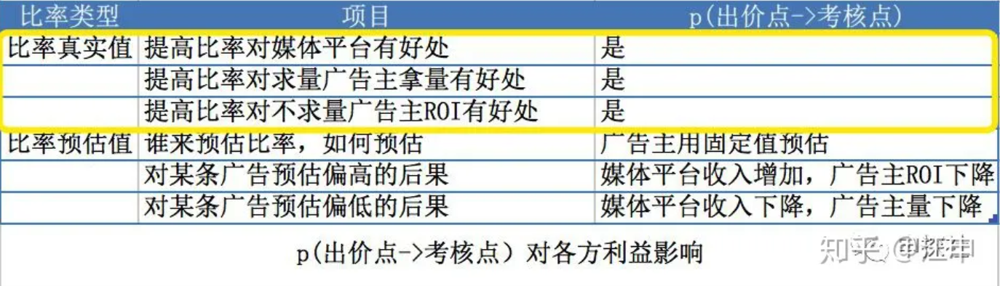
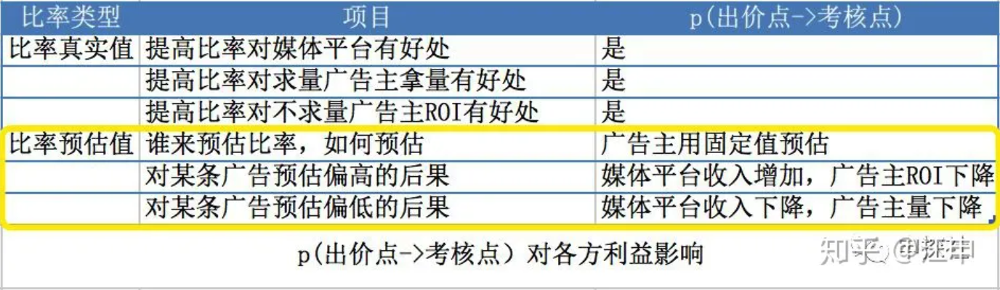
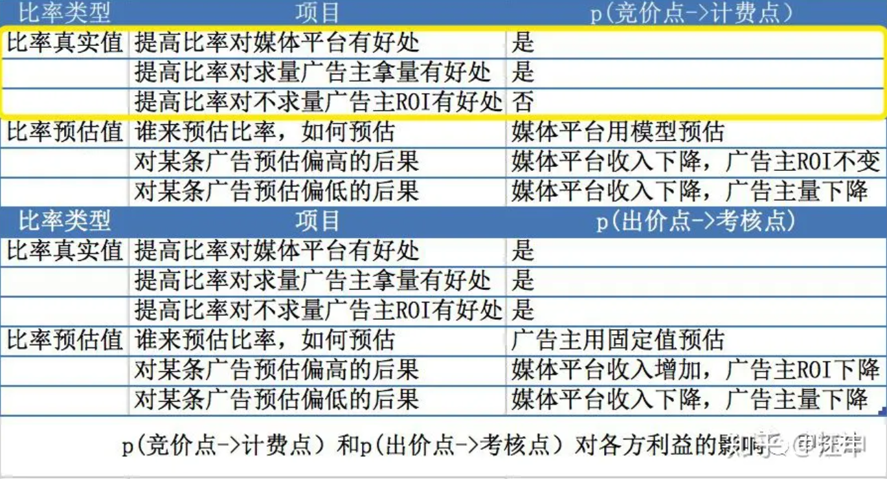
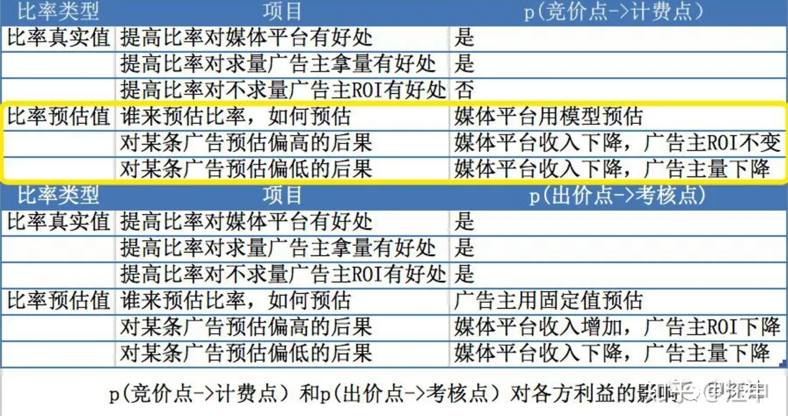
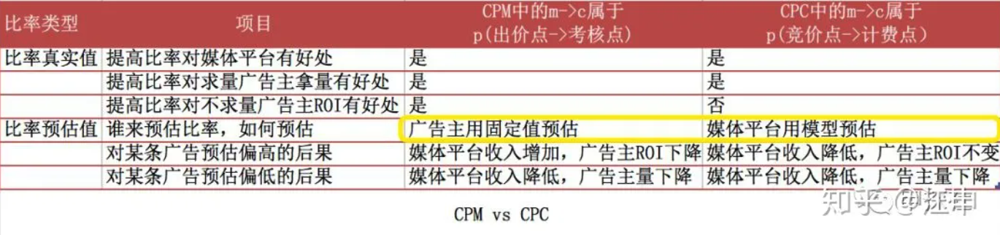
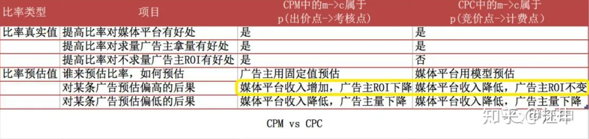
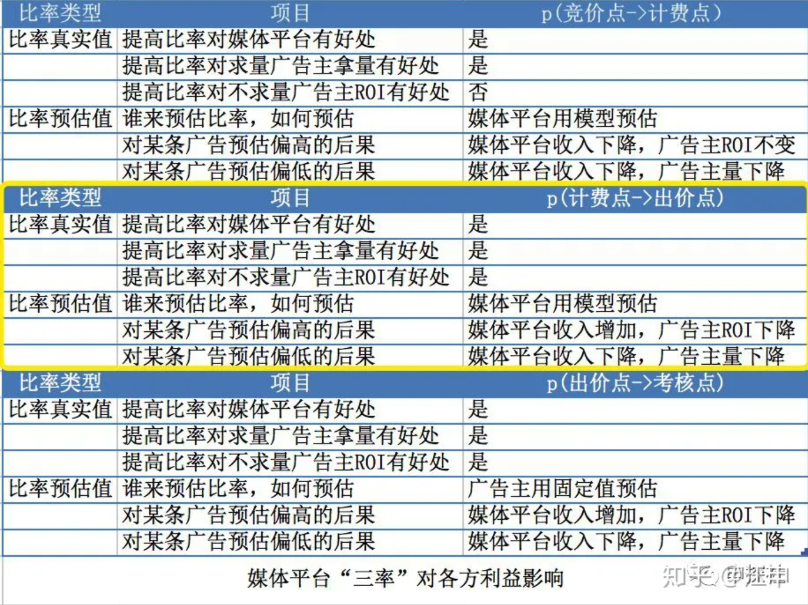

创建于 2023-08-30
关键词: 大媒体广告平台, 计算广告, 互联网广告, 出价模式, 智能出价.

## 导读

互联网广告中的出价模式发展经历了许多变迁。从一开始的CPM，到CPC出价模式，随着Facebook的oCPX(如oCPM/oCPC)成为了网红，之后的双出价，激活且付费，Facebook的AEO及VO等等新一代的出价模式也层出不穷。本文会介绍并使用一个较为通用的**“四点三率两控制一加强”**分析框架，对各个出价模式进行解析。

## 广告投放平台

很多小媒体通常没有技术实力来建立自己的广告投放平台，而像Facebook/谷歌等这样的大媒体都有建立自己的广告投放平台，对自有流量进行变现，这时大媒体同时又是广告投放平台，本文中简称“媒体平台”。

## 广告受众行为

一条互联网广告通常会经过以下的几个过程，以Facebook Feeds(信息流)为例，当用户打开Facebook时，有时会浏览到一条广告（广告展现impressions，记为m），用户可能会点击(click, 记为c)这条广告下方的“立即购买”（CALL TO ACTION, 也可以是其它的，如：”去逛逛“等），跳转到详情页面中(比如独立站店铺的页面)，用户可能会继续点击”加入购物车“或其它按钮等（CALL TO ACTION之后，用户可以进行很多动作，如浏览落地页、加购物车、添加支付信息、下单购买等等，本文假设广告主期望用户最终产生的动作是下单购买，此时action记为a）。

## CPM广告

CPM广告是按照广告展现的次数来收费，因为每次展现的费用数字很小，所以大家约定乘以1000，即千次广告展现的费用。如果广告主A的一条广告CPM出价为每千次10元，广告主B的一条广告CPM出价为每千次12元，那么媒体平台就根据CPM出价进行排序，取第一名的广告（即广告主B的广告）进行展现（为了表述清晰，假设该广告位只出一条广告，后面的讨论也基于这个设定）。

## CPC广告

CPC广告是按照广告被点击的次数来收费，因为单个点击的费用通常已经足够大，所以不用乘以1000了。如果广告主A的一条广告CPC出价为0.3元，广告主B的一条广告CPC出价为0.4元，这个时候媒体平台并不是直接出CPC出价更高的广告主B的广告，因为两个广告的点击率可能并不相同。这个时候媒体平台通常会用点击率预估模型，预估每个广告分别的点击率（eCTR），即从m到c的概率p(m->c)，再用

```text
eCPM=eCTR*CPC*1000
（需要乘以1000是因为CPM是1000次展现的价格）
```

分别计算得到两条广告的eCPM (expected CPM)。假设广告主A的点击率eCTR_A预估为0.03，广告主B的广告eCTR_B为0.02，那么计算得到

```text
eCPM_A = 0.03 * 0.3 * 1000 = 9元
eCPM_B = 0.02 * 0.4 * 1000 = 8元
```

再根据eCPM排序出最高的广告主A的广告。

值得注意的是，虽然排序按eCPM排，但不是按照eCPM来计费的，还是按照CPC来计费。也就是说，如果这条广告被用户点击了，媒体平台会收广告主0.3元。如果没有被用户点击，媒体平台不收广告主钱。

**行为价格换算公式：**

从m->c->a的过程中，每个行为A的价格，等于后续行为B的价格乘以行为A到行为B的比率。例如

```text
CPM=p(m->c) *CPC * 1000
(唯独CPM要多乘以1000）
CPC=p(c->a) *CPA
```

这个是做广告算法最经常用到的公式之一，可以将不同行为的价格进行换算。

## **“四点三率两控制一加强”里的“四点”**

**竞价点：**其实不管是CPM，CPC还是后续的CPA，oCPM(optimized CPM)，oCPC(optimized CPC)，双出价等所有出价模式，绝大多数媒体平台最终都是根据换算公式，将出价换算成eCPM，再对eCPM排序后，选择eCPM最高的广告进行展现。这样媒体每个展现机会的收益可以很直接地被度量，也能最大化自身的利益。在本文中，我们讨论的“竞价点”都在m（展现）。

**计费点：**即媒体平台最后是按什么的个数来收广告主的钱。例如CPM中，是按照展现次数来收费，那么计费点就是m。而在CPC广告中，虽然按照eCPM排序来决定出哪个广告，但是对于出的广告，是按照点击次数来收费，这时计费点是c。

**出价点：**即广告主在媒体平台的投放后台里填写的是什么价格。在CPM和CPC广告中，出价点和计费点是在同一个点，CPM的出价点也是m，填写的是千次展现价格, 而CPC广告出价点是c，填写的是每个点击的价格。而在oCPX中，出价点和计费点是分离的。

**考核点：**在广告投放中，通常会找一个好量化的指标来考核投放优化师的工作。例如七日ROI之类的，我们把这个点叫做考核点。后面的分析中，我们假设考核点为下单购买（记为a），实际中可以是别的点，但是不影响我们讨论的结论。

在CPM出价模式下，竞价点/计费点/出价点都是m，考核点假设在a。而对于CPC出价模式，竞价点在m，计费点/出价点在c，考核点假设在a。

对应着四个点的，就是三个比率，p(竞价点->计费点), p(计费点->出价点), p(出价点->考核点)。

CPM/CPC以及本文后续所讨论的所有出价模式，其中很大的区别就在于这四个关键点在不同位置。我们只要把这四个关键点和他们之间的三个比率对于双方的利益影响分析清楚了，那么就能推广到所有的出价模式。接下来，我们逐步引出每个比率以及分析对各方利益的影响。

另外，用户（网民）其实也是一个参与的角色，但各媒体对用户的诉求（用户体验）考虑的程度不一样，考虑的方法也不尽相同，所以在本文的讨论中，只讨论媒体平台，广告主双方的博弈。

## “三率”之p(出价点->考核点)

我们看看在CPM和CPC下广告主是如何设定出价点的出价的？

**CPM出价模式：**假设我们在推广一款产品，通过核算得到一笔订单的获取成本在24美元以下，就能有钱赚。也就是说，广告主内心有个隐含的订单转化出价（即隐含预期eCPA=24美元），后续简称为转化出价。那么广告主会根据之前的投放数据，估计一个从p(m->a)的概率，假设估计点击率eCTR p(m->c)大概0.03，eCVR p(c->a)大概0.07，那么整个p(m->a)就是0.03*0.07=0.0021，所以有

```text
eCPM = p(m->a)* eCPA*1000
eCPM = 0.0021 * 24 * 1000 = 50.4 美元
```

所以广告主的CPM出价就设为50.4美元。

**CPC出价模式：**也是类似的，广告主的CPC出价中，会隐式地包含一个用固定值预估的p(出价点->考核点），在CPC中为p(c->a)，从而将考核点的出价（转化出价），换算得到出价点的出价（即CPC出价）。

我们发现在CPM和CPC中（其实对于其他出价模式也一样适用），都会涉及到p(出价点->考核点）这个比率，即出价点（CPM的m, CPC的c）到考核点a这一段的比率。接下来我们看看这个比率的真实值的高低，和预估值的准确度，分别对博弈双方（即媒体平台和广告主）都有什么利益影响。先放结论，再一个一个分析。



**p(出价点->考核点) 比率真实值高低对媒体和广告主的影响**

提高p(出价点->考核点)这一段比率的真实值，对于求量的广告主，在同样转化成本下可以换算得到更高的出价点的价格。例如CPM模式中的CPM价格。从而赢得更多的原本不能赢得的展现机会，拿到更多的量，因此媒体平台的收入也会增加。而对于预算有限不求量的广告主，保持出价点的出价不变的情况下，获得更多的转化，ROI提升。

所以在提高p(出价点->考核点)的真实值上，媒体平台和广告主是完全利益相同的，例如CPM模式下媒体平台会通过优化广告位位置，从而提高点击率来提升p(出价点->考核点)。因为利益一致，广告主在这方面可以信任媒体平台提供的建议和工具。



**p(出价点->考核点) 比率预估值准确度对媒体和广告主的影响**

对于任何一个用户，广告主都是显式或者隐式地用固定的一个值（虽然会调整，但是同一时刻对于不同流量是固定的）来预估p(出价点->考核点)，从而把转化出价转化成出价点出价。显然事实上每个用户的这个比率是不一样的。因此这个预估值有时候会偏高，造成出价点出价过高，广告主ROI下降，对于媒体平台来说，收入增加；有时候偏低，造成竞价点的CPM值偏低，竞价不利，不能获得足够的量，对于媒体平台来说，收入下降。

由广告主用固定值预估的p(出价点->考核点)偏高偏低都会让广告主自身利益受损，因此广告主有动力通过调整出价来调整这个预估值，提高准确度。

## **“三率”之p(竞价点->计费点）**

对于CPC来说，和CPM不一样的地方在于计费点和出价点都在c了，而竞价点一直在m。因此，会有一个p(竞价点->计费点)的率。接下我们探讨这个比率真实值的高低，和预估值的准确度，对博弈双方（即媒体平台和广告主）都有什么利益影响。先放结论，再一个一个分析。



**p(竞价点->计费点)比率真实值高低对媒体和广告主的影响**

提高从竞价点（m）到计费点（例如在CPC出价模式中是c)这段的真实值(CTR)，对于求量的广告主，在同样的付费点出价上，可以换算得到更高的eCPM。（例如在CPC出价模式中，eCPM=eCTR * CPC * 1000），赢得更多的原本不能赢得的展现机会，拿到更多的量。因为CPM提高了，媒体也获得了更多的收入。

但是，对于不求量的广告主，不一定是这样了。那么对于不求量的广告主，为什么提高p(竞价点->计费点）的真实值，对他们没有好处呢？一个很容易想到的原因是广告是按照计费点处行为的个数来计费的，例如计费点在点击c处，没有点击是不收广告主钱的。广告平台从100个展现里带来2个点击还是从10个展现里带来2个点击，对于广告主来说都是花一样多的钱带来一样多的点击，点击率的提高并没有直接给广告主带来好处。而且在有些情况下，p(竞价点->计费点）的比率越低，反而对不求量广告主来说更好。作为媒体平台，因为互联网的边际服务成本很低，求量的广告主一般占多数，所以影响一般不是很大。



**p(竞价点->计费点)比率预估值准确度对媒体和广告主的影响**

和CPM不一样，从m到c这一段，也就是p(竞价点->计费点）这一段的预估，是由媒体平台通过机器学习来预估的。每一个用户每一个广告在不同的上下文(context)的预估值通常都是不一样的。

如果对某一条广告的预估值偏高，那么该广告在竞价点的CPM会比较高（因为CPM=p(竞价点->计费点）* p(计费点->出价点）* 出价点的出价），抢占了其他广告的展现机会，但是实际发生的计费数又少，广告平台的收入就降低了。对于广告主来说，计费数少计费也会成比例少，最终ROI没有明显变化。

如果对某一条广告的预估值偏低，那么该广告在竞价点的CPM会比较低，竞价队列里不是最优的广告会排到更前面，导致广告平台的收入也降低。对于广告主来说，拿到的量就少了。

所以我们看到，媒体平台对于p(竞价点->计费点）的预估越准确，收入越高。对于广告主来说，主要就是影响拿量的多少，相对来说，影响较小。

**从CPM到CPC，媒体平台和广告主的博弈关系发生了什么变化？**



**从CPM到CPC对广告主的影响**

如果考核点在c以及c之后，从CPM到CPC，广告主的利益得到了很大的保证。原来广告主用固定值预估p(m->c)，会非常不准，而且不管偏高还是偏低，都会广告主的ROI或者量有负面影响。而在CPC中，p(m->c)属于竞价点->计费点这一段。这个值（点击率）由掌握用户特征和label的媒体平台用机器学习模型预估，会比广告主用固定值预估准得多，而且如果预估偏高，广告主的ROI也不会受到明显影响。所以广告主用CPC比CPM几乎只有好处没有坏处。

对于某些只考核m不考核c的品牌广告主，考核点就在m，上述分析都不适用了，这类广告主不会使用也没有必要使用CPC。



**在CPM到CPC对媒体平台的影响**

如果广告主考核点在c以及c之后，从CPM到CPC，对媒体来说也是利大于弊的。CPM中p(m->c)是由广告主用一个固定值来预估所有广告的p(m->c)，假设广告主预估非常准，即用所有广告的均值来当做这个固定值。那么会有近一半的广告高估，一半的低估。在一段时间之后，广告主会发现预估偏低的很多竞价失败，而偏高的容易竞价成功。所以在看报表时，投放出去的广告的平均成本是要明显高于出价的。这个时候广告主要达到目标成本，就必须要降低这个用来预估的固定值（也就是降低出价点的出价）,导致大部分的预估都是偏低的，也就是媒体平台的收入主要是降低的。而在CPC模式的实际投放数据表明，虽然媒体平台承担了p(m->c)预估不准的带来的后果（因为不管偏高还是偏低，都由媒体平台买单），但是因为预估准太多了，损失比在CPM中由于广告主预估值明显偏低带来的媒体平台收入下降带来的损失更小。所以综合来看，媒体平台在CPC模式下收入也是增加的。

另外，比率真实值部分，CPC模式下，预算有限的广告主，在是否提升m->c这一段比例的诉求，利益和媒体平台不一致了。还好这一部分影响相对比较小，实际投放中，CPC对于媒体平台来说还是明显利大于弊。

**什么情况下可以使用CPA模型？**

CPC的成功，让人不禁思考一个问题，是否可以如法炮制，把计费点和出价点移动到a，这也就是CPA的模式。

如果a行为的数据，也是媒体平台能完全控制完整收集的，那么没有问题，CPA模式也是成立的。例如媒体平台是淘宝，广告主推广自己在淘宝的产品，那么淘宝可以完全掌控a的行为，那么做CPA是可以的。

如果a行为的数据，是由广告主收集的，再由广告主自己回传给媒体平台，那么把计费点移动到a就会有问题。比如广告主出价是80块一个a行为，那么广告主就有动力一直不回传a行为的数据，或者克扣部分a行为的数据给媒体平台，从而让媒体平台少收了广告主的钱。

所以我们可以得到一个准则：

**付费点通常不能超过媒体平台完全控制的行为点，不能到达由广告主收集的行为点。**

## **“三率”之p(计费点->出价点)**

按上面的分析，如果a行为由广告主负责收集，那么我们就不能直接按CPA出价和计费，p(c->a)这一段的预估还是只能由广告主用固定值来预估，根据上面的分析，对于广告主和媒体平台都是不利的。**p(c->a)这个比率预估的特征数据（用户特征和广告特征）在媒体平台手里，但是label是在广告主手里。所以如果要预估p(c->a)，必须有一方让步把数据给另外一方。**

通常媒体平台比各个广告主具有更好的数据分析能力，广告主把label数据给了媒体平台（下面会分析为什么广告主有动力这么做），由媒体平台进行p(c->a)来预估。这时候FB创新的oCPX就出现了，它把出价点和计费点分离了，计费点在m(或c)而出价点在a。

**我们可以这么来理解oCPX：oCPX=计费点和出价点分离+连续竞价下的智能出价控制**

**即广告主把行为数据主动给媒体平台，由媒体平台免费为广告主提供把出价点价格转化成计费点价格的出价转换服务（通过预估p(c->a)的方式）。另外媒体平台提供在连续竞价下的智能出价控制服务。**



**p(计费点->出价点) 比率真实值高低对媒体和广告主的影响**

p(计费点->出价点)越高，根据广告主出价点的出价换算到计费点出价再换算到竞价点的CPM出价也会越高，广告平台收入提升。对于求量广告主来说，这个比率越高，换算的CPM出价也越高，越容易拿到量。对于不求量的广告主，保持付费点出价不变的情况下，获得更多的出价点行为，ROI得到提升。

我们可以发现在提高 p(计费点->出价点）比率的真实值上，媒体平台和广告主的利益也是一致的。

**p(计费点->出价点) 比率预估值准确度对媒体和广告主的影响**

对于由媒体平台用模型预估的预估值，如果偏高的话，广告主在计费点的出价就会偏高，导致ROI下降。如果偏低的话，导致换算到竞价点的CPM偏低，拿不到量。对于媒体平台来说，预估值偏高，会换算得到更高的计费点出价和竞价点CPM出价，收入增加。而预估偏低的话，从出价点换算得到的CPM就比较低了，广告队列竞争激烈程度不够，媒体平台收入下降。

这里我们会发现一个问题，由媒体平台预估的p(计费点->出价点)在预估偏高时，媒体平台自己是受益的，而对广告主不利的。媒体平台短期有动力高估这个比率，这个问题怎么解决呢？

